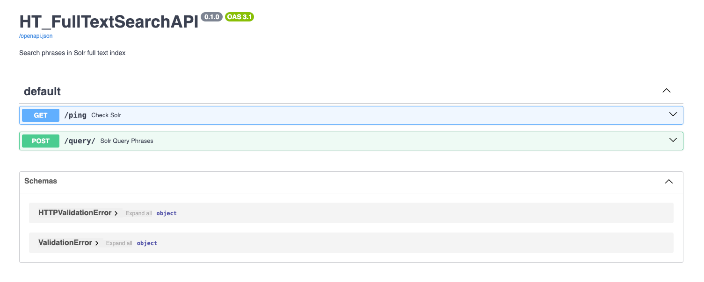

<br/>
  <p align="center">
    Solr Query Interface
    <br/>
    <br/>
    <a href="https://github.com/hathitrust/index_search_monorepo/tree/main/app/solr_query_interface">README.md</a>
    -
    <a href="https://github.com/hathitrust/ht_full_text_search/issues">Request Feature</a>
  </p>

## Table Of Contents

* [About the Project](#about-the-project)
* [Built With](#built-with)
* [Phases](#phases)
* [Project Set Up](#project-set-up)
  * [Prerequisites](#prerequisites)
  * [Installation](#installation)
  * [Creating A Pull Request](#creating-a-pull-request)
* [Content Structure](#content-structure)
  * [Project Structure](#project-structure)
  * [Site Maps](#site-maps)
* [Design](#design)
* [Functionality](#functionality)
* [Usage](#usage)
* [Tests](#tests)
* [Hosting](#hosting)
* [Resources](#resources)

## About The Project

This application is a command line tool that allows searching for documents in Solr server. The application was generated
when the `ht_search` and `ht_indexer` projects were merged into a monorepo. The purpose of this application is to provide a
simple and efficient way to search for documents in a Solr server using different query types.

This application contains an API to search documents in the Solr server using an exact match query. 
The API is based on the [FastAPI](https://fastapi.tiangolo.com/) library. In addition, it provides some Python scripts to run experiments on the 
Solr server and compare the results of different queries.

## Built With

* [Python](https://www.python.org/)
* [Poetry](https://python-poetry.org/)
* [Pytest](https://docs.pytest.org/en/stable/)
* [Docker](https://www.docker.com/)
* [Makefile](https://www.gnu.org/software/make/)
* [Solr](https://lucene.apache.org/solr/)
* [FastAPI](https://fastapi.tiangolo.com/)
* [Black](https://black.readthedocs.io/en/stable/)
* [Ruff](https://ruff.rs/)
* [Requests](https://docs.python-requests.org/en/latest/)
* [Uvicorn](https://www.uvicorn.org/)
* 
## Phases
- Phase 1—Currently doing
  - Create an API to search documents in Solr server
  - Create an API to export all the results of a query in Solr server
  - Export all the results of a query in Solr server to a CSV file
  - Compare the results of queries to extract statistics 

- Phase 2—Next Steps


## Project Set Up

In your local environment, you can use the `docker-compose.yml` file to set up the services to search
documents in Solr server.

The application is designed to run in a Docker container. The Makefile is used to build the Docker image and run the 
container.

In the work directory, you can run the following commands to set up the application:
```bash
cd app/solr_query_interface
# Build the Docker image
make build
# Create the Docker container and set up the environment variables
make run
```

When the container is running, some services will be started, including:

* A Solr server with authentication. In Docker, all the users (`admin`, `solr`, `fulltext`) use the same password `solrRocks`.
* An API to search the documents in the Solr server. 
  * Access the API documentation in http://localhost:8000/docs. 
* A service to index a sample of data (150 documents) is indexed in the Solr server to test the application.

### Prerequisites
* Docker
* Python 3 and Poetry (If you want to run the application in your local environment). See the installation section below.
  * To access to prod Solr server, you need it, 
    * to have a VPN connection to the HathiTrust network
    * to set up an ssh tunnel `ssh -L8081:macc-ht-solr-lss-1.umdl.umich.edu:8081 test.babel.hathitrust.org`.
    * the Solr URL will be http://macc-ht-solr-lss-1.umdl.umich.edu:8081/solr/core-1x/query
    * to run the application in your local environment with the parameter `--env prod`.We don't have an 
    acceptable alternative, nor is it necessary to set up access to the production server via a Docker file.
  * To query production, you will have to run the application locally and open an ssh connection to macc-ht.
  * To locally run the application, you can also set up the environment variable `HT_ENVIRONMENT` (dev or prod) to define the desired environment.

In your workdir,
  
      * `cd app/solr_query_interface` # Change to the solr_query_interface directory
      * `poetry init` # It will set up your local environment and repository details
      * `poetry env use python` # To find the virtual environment directory, created by poetry
      * `source ~/solr_query_interface-TUsF9qpC-py3.11/bin/activate` # Activate the virtual environment in Mac
      * `poetry install` # Install the dependencies in the virtual environment
      * `poetry update` # Update poetry.lock file with the latest versions of the dependencies
      * `C:\Users\user_name\AppData\Local\pypoetry\Cache\virtualenvs\solr_query_interface-d4ARlKJT-py3.12\Scripts\Activate.ps1` # Activate the virtual environment in Windows
      * ** Note **: 
              If you are using a Mac, poetry creates their files in the home directory, e.g. /Users/user_name/Library/Caches/pypoetry/.
              If you are using Windows, poetry creates their files in the home directory, e.g. C:\Users\user_name\AppData\Local\pypoetry\


### Project Structure

The project is structured as follows:

```
    ├── ht_search 
    ├── documentation
    │   ├── search_api_documentation.png
    ├── src
        ├── data_analysis
        │   ├── compare_results.py
        │   ├── generate_query_results.py
        │   ├── generate_query_results_in_batch.py
        │   ├── get_collection_statistics.py
        │   └── [other scripts]
        ├── ht_full_text_search
        │   ├── __init__.py
        │   ├── main.py
        │   ├── ht_full_text_searcher.py
        ├── indexing_data.sh
    ├── tests   
    ├── Dockerfile
    ├── poetry.lock
    ├── pyproject.toml
    ├── README.md 
    ├── Makefile
 ```

## Design

The infrastructure of the library is based on the following classes. The classes are used to create the Solr query 
and search the documents in the Solr server. In the image below, you can see the classes and their relationships.


The main classes are:
* This application depends on the `ht_search` library, which is responsible for searching documents in the Solr server.
* `indexing_data.sh`: This script is responsible for indexing data in the Solr server. 
  In the folder `solr_dataset` there is a list of documents to index in the Solr server.
* * `indexing_data.sh`: This script is responsible for indexing data in the Solr server. 
  In the folder `solr_dataset` there is a list of documents to index in the Solr server.

## Usage

If you will use this application outside the docker file, you will have to change the Solr URL in the file `config_search.py`

SOLR_URL = {
    "prod": "http://macc-ht-solr-lss-1.umdl.umich.edu:8081/solr/core-1x/query",
    "dev": "http://localhost:8983/solr/core-x/query"
}

**Phase 1**
- Initially, the application was created to run experiments comparing the results of the full-text search 
- in Solr (test environment Solr 8 cloud mode) with the results of the full-text search 
- in the HathiTrust full-text search service (Solr 6 standalone mode).

Use case 1: Implement the Python script `ht_full_text_searcher.py` to retrieve documents from solr using the same logic 
as in HathiTrust ls module. A Python version of the ls module is implemented in the `ht_search` library.
The script `ht_full_text_search/ht_full_text_searcher.py` is responsible for creating the Solr query and searching the documents 
in the Solr server with the following parameters.

* `--env` is the environment where the application is running. It can be `dev` (Solr 8) or `prod` (Solr 6)
* `--query_string` is the string to search in the documents. 
  * In case of a multi-word string, it must be between quotes e.g. `"justice league"`
* `--operator` is the operator to use in the query. I operator is None, you do not have to pass it to the command line
  * It can be `AND` or `OR` or None, that means the query will find exact matches
* `--query_config` is the configuration to use in the query. It can be `all` or `ocronly`
  * `all` means that the query will search the input string in all the fields of the documents
  * `ocronly` means only the ocr field will be used in the query

  * Example of command to run the application with the query you want to search in the Solr server. 
  The command below will search the exact phrase `Congreso de los Diputados` in the full text of the documents because operator is None.
      ```
      docker compose exec solr_query_api python src/data_analysis/ht_full_text_searcher.py 
    --env dev --query_string "Congreso de los Diputados" --query_config ocronly
      ```
    * The output of the command below is a list of documents that contain the exact phrase `Congreso de los Diputados` in the full text,
  
      ```
      {
      "title": [
          "Diario de las sesiones ... Legislatura ..."
      ],
      "author": [
          "Spain. Cortes. Congreso de los Diputados"
      ],
      "id": "chi.096189208",
      "shard": null,
      "score": 284897.53
      }
      ```
    
**Use case 2**: Run a batch of queries and save the results in a csv file. This use case is based on use case 1 to
retrieve documents from Solr. However, in this case, the application will receive a list of phrases to search in the 
Solr server and the results will be saved in a csv file. The user must create the file (e.g. `list_query_file.txt`) with the
list of phrases to search in the Solr server.

This use case is implemented in the `src/data_analysis/generate_query_results_in_batch.py` script. 

The script receives the following parameters:

  * `--env` is the environment where the application is running. It can be `dev` (Solr 8) or `prod` (Solr 6)
    * If env=prod, then the parameter `use_shard` is True, then the Solr URL will include all the shards of the Solr server
  * `--solr_url` is the url of the Solr server
    * If env=prod, then the Solr url is extracted from the configuration file config_search.py
  * `--fl` is the field to return in the query
  * `--filter_path` Path of a JSON file used to filter Solr results
  * `--query_config` is the configuration to use in the query. It can be `all` or `ocronly`
    * `all` means that the query will search the input string in all the fields of the documents
    * `ocronly` means only the ocr field will be used in the query
  * `--list_phrase_file` TXT file containing the list of phrase to search in the Solr server

The script will create a CSV file with the result of each query in the list of phrases. 
All the CVS files will be saved inside the folder data_analysis/query_results.
To name the CSV file the following parameters are concatenated:
  - the fields (only the OCR or all the fields), 
  - the operator and 
  - the environment (prod or env) where the query was executed.

example of the name of the CSV file:
 - solr6: "ocronly_Charge point software cybersecurity_AND_prod.csv"
 - solr8: "ocronly_Charge point software cybersecurity_AND_env.csv"

* Example of command to run the application with the queries you want to search in the Solr server

        ```docker compose exec solr_query_api python src/data_analysis/generate_query_results_in_batch.py \
              --env dev \
              --list_phrase_file src/data_analysis/list_query_file.txt \
              --query_config ocronly
        ```
  
* The output of the command below is a csv file with the results of the queries in the Solr server.
    
        ```
          query_string,operator,author,title,score
          "justice blame",None,"Kyd, Thomas, 1558-1594.","The first part of Jeronimo",52303.336
          "justice blame",AND,"Kyd, Thomas, 1558-1594.","The first part of Jeronimo",52303.336
          "justice blame",OR,"Kyd, Thomas, 1558-1594.","The first part of Jeronimo",52303.336
        ```

**Use case 3**: Compare the results with the expected ones or with the results of another query or search engine

This use case is implemented in the `solr_query_interface/src/data_analysis/compare_results.py` script.It was created as part of the experiments 
to compare the results of the full-text search in Solr (dev) with the results of the full-text search 
in the HathiTrust full-text search service (prod). When this use case was created, two Solr servers were running. 
The production server was running Solr 6 in standalone mode, and the development server was running Solr 8 in cloud mode.
The main goal was to compare the query results, considering the search engine on Prod server was
used the classic similarity algorithm (tf-idf) to rank the documents, and the search engine on Dev server 
was used the BM25 similarity algorithm.

You can find [here](https://hathitrust.atlassian.net/wiki/spaces/HAT/pages/2742255677/Relevance+experiments) the documentation of these experiments: 

The script receives the following parameters:
  * `--list_phrase_file` TXT file containing the list of phrase to search in the Solr server

To run the script, you should have CSV files in `solr_query_interface/src/data_analysis/query_results`
folder with the results of the queries in PROD and DEV servers.

* Example of command to run the application with the queries you want to search in the Solr server

        ```docker compose exec solr_query_api python src/data_analysis/extracting_diference_solr_results.py \
              --list_phrase_file src/data_analysis/list_query_file.txt
        ```
**Phase 2**:
- Create an API to search documents in Solr server
- This API is based on the FastAPI library. 

**Use case 4**: Do the same exact phrase query but export all results using solr result streaming:

- This use case originated from an HTRC request. The HTRC needs to get the htids of the documents that are useful for creating the dataset.
- The API is implemented in the `main.py`, that uses the script `ht_search/src/export_all_results.py` to search the documents in the Solr server.

The API is running in the docker with the service name `solr_query_api` where `docker compose up -d` is executed.

To check the API is running, you can access the URL `http://localhost:8000/docs` in your browser.

You will see the following screen with the API endpoints:



* Query endpoint: 

`curl --location 'http://localhost:8000/query/?query=biennial%20report' --form 'query="'\''\"biennial report\"'\''"'`

* Status endpoint: 

`curl --location 'http://localhost:8000/ping/'`

* You can also run the script `export_all_results.py` to search the documents in the Solr server.

```docker compose exec solr_query_api python ht_search/src/ht_search/export_all_results.py --env dev --query '"good"'```

* You can also run the API to search the documents in the Solr server (dev environment) using the command below in the terminal:
```docker compose exec solr_query_api python data_analysis/main.py --env dev```. The Solr URLs to access dev and prod 
environments are in the file `config_search.py`.

If you want to run the API or the `export_all_results.py` script using HTRC access point, you will have to run 
the application outside the docker because it will access to the full-text search production index:

To access full-text search index using HTRC Solr access point:

  * ask Samitha to add your IP in the HTRC proxy.
  * contact Samitha or Lianet to get the right Solr URL to access the HTRC Solr server. You will have to pass the Solr 
    URL as a parameter in the command line.
  * run the application outside the docker and using the parameters below: 
    * `--env prod` and `--solr_url https://htrc_solr_url/...` 
    
For example, use the command below to run the script `export_all_results.py`:

```python libs/ht_search/src/ht_search/export_all_results.py --env prod --query '"poetic justice"' --solr_url https://htrc_solr_url/...``` 

and the command below to run the API:

```python main.py --env prod --solr_url https://htrc_solr_url/...```

Once the API is up, we can use the command below to query the full-text search using the API:

```curl --location 'http://localhost:8000/query/?query=poetic%20justice' --form 'query="'\''\"poetic justice\"'\''"'```

**Use case 5**: Create an Excel file with collection statistics using Solr facets. 

- This use case is relevant to get the following statistics from our Solr collection:
    - Distribution of documents per language (tab: Language dist all)
    - Distribution of documents per publication place (tab: Place of Pub)
    - Distribution of documents per range of publication date (tab: Date Dist)
    - Distribution of documents per Institution (tab: Source Libs)
    - Distribution of documents per Library of Congress classification (tab: LC Class)
    - Distribution of documents per Domains (tab: Public Domain dist)

The script `data_analysis/get_collection_statistics.py` is responsible for creating the Excel file with the collection statistics.
The generated Excel file will be saved in the folder `data_analysis/collection_statistics_2024.xlsx`.

```docker compose exec solr_query_api python src/data_analysis/get_collection_statistics.py --env dev --map_file_path lib/ht_search/src/ht_search/map_call_number.properties```

To get the collection statistics from production Solr server, you will have to run the 
application outside the docker and using the command below:

```python data_analysis/get_collection_statistics.py --env prod --map_file_path lib/ht_search/src/ht_search/config_files/map_call_number.properties```

Note: To find all the distribution by rights categories, you can query the table `attributes` in MySql database.

**Phase 3**: Create scripts to monitor the Solr servers and the application.

- Create the script `~/ht_solr_monitoring/solr_query_monitoring.py` to generate queries to test the performance of the Solr cluster.

**Use case 1**: Downloading large result sets (over 20,000 items) using cursor-based paging and using the Solr export handler.
**Use case 2**: Create different kinds of Solr queries to measure their performance.

- These use cases are relevant because we want to monitor the query performance of our different Solr clusters. 
We have created some Grafana dashboards, and we need the flexibility to add different kinds of queries and see how the cluster 
works. 

The main logic to create the queries is in the script `ht_solr_monitoring/solr_query_monitoring.py`. Currently, there are two different
alternatives to query Catalog and Full Text Solr servers. We can run the script with the following parameters. 
For Catalog, you should change --cluster_name to catalog. The script allows you to pass the name of the collection, 
the environment and the solr host. If you run the script on your local environment the solr host will be http://localhost:8983.

```docker compose exec solr_query_api python src/ht_solr_monitoring/solr_query_monitoring.py --solr_host http://solr-lss-dev:8983 --collection_name core-x --env dev --cluster_name fulltext```
