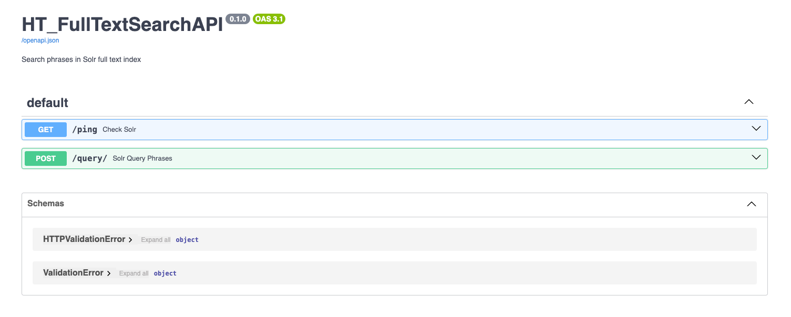

<br/>
  <p align="center">
    Full_text_search
    <br/>
    <br/>
    <a href="https://github.com/hathitrust/ht_full_text_search/issues">Report Bug</a>
    -
    <a href="https://github.com/hathitrust/ht_full_text_search/issues">Request Feature</a>
  </p>

## Table Of Contents

* [About the Project](#about-the-project)
* [Built With](#built-with)
* [Phases](#phases)
* [Project Set Up](#project-set-up)
  * [Prerequisites](#prerequisites)
  * [Installation](#installation)
  * [Creating A Pull Request](#creating-a-pull-request)
* [Content Structure](#content-structure)
  * [Project Structure](#project-structure)
  * [Site Maps](#site-maps)
* [Design](#design)
* [Functionality](#functionality)
* [Usage](#usage)
* [Tests](#tests)
* [Hosting](#hosting)
* [Resources](#resources)

## About The Project

Application for full-text search documents in Solr server. This application reproduces the queries we use in the 
HathiTrust full-text search service.

This application is a command line tool that allows to search documents in a full-text search Solr server. 

## Built With
It is based on the [requests](https://docs.python-requests.org/en/latest/) library to access the Solr server.

The application runs in a docker container, and it is based on the [python:3.11.0a7-slim-buster](https://hub.docker.com/_/python) image. 
Their dependencies are managing to use [poetry](https://python-poetry.org/). 

To run the application, it is necessary to have a Solr server running. A sample of data (150 documents) is indexed 
in the Solr server every time the container is started.

This application also contains an API to search documents in the Solr server using an exact match query. 
The API is based on the [FastAPI](https://fastapi.tiangolo.com/) library.

## Phases
- Phase 1—Currently doing
  - Application to search documents in Solr server
  - Export all the results of a query in Solr server to a CSV file
  - Compare the results of queries to extract statistics 

- Phase 2—Next Steps
  - Create an API to search documents in Solr server
  - Create an API to export all the results of a query in Solr server

- Phase 3—Future Additions

## Project Set Up
* In your work directory,
  * Run the script ./init.sh to create the image and set up all the environment variables used in the application
  * Start the container with the service involved in the search
  `docker-compose up -d`


### Prerequisites
* Docker
* Code Editor
* Python 3 and Poetry (If you want to run the application in your local environment)
  * To access to prod Solr server, you need it, 
    * to have a VPN connection to the HathiTrust network
    * to set up an ssh tunnel `ssh -L8081:localhost:8081 squishee-1.umdl.umich.edu`
    * to run the application in your local environment with the parameter `--env prod`.We don't have an 
    acceptable alternative, nor is it necessary to set up access to the production server via a Docker file.
  * To query production, you will have to run the application locally and open and ssh connection to squishee-1. 

### Installation

1. Clone the repo
   ``` git clone https://github.com/hathitrust/ht_full_text_search.git```

2. Set up development environment with poetry

  In your workdir,
  
      * `poetry init` # It will set up your local environment and repository details
      * `poetry env use python` # To find the virtual environment directory, created by poetry
      * `source ~/ht-full-text-search-TUsF9qpC-py3.11/bin/activate` # Activate the virtual environment
      * `poetry add pytest` # Add dependencies

### Creating A Pull Request

1. Create your Feature Branch (`git checkout -b feature/AmazingFeature`)
2. Commit your Changes (`git commit -m 'Add some AmazingFeature'`)
3. Squash your commits (`git rebase -i HEAD~n` where n is the number of commits you want to squash)
4. Push to the Branch (`git push origin feature/AmazingFeature`)
5. Open a Pull Request

## Content Structure

Miro board: [Full text search](https://miro.com/app/board/uXjVM1-Swlw=/)

### Site Maps

This repository contains the following files:

### Project Structure

The project is structured as follows:
    
    ```
    ├── ht_full_text_search 
    │   ├── __init__.py   
    │   ├── export_all_results.py
    │   ├── ht_full_text_searcher.py
    |   ├── search.py

    │   ├── search.py
    │   ├── scripts
    │   │   ├── compare_results.py
    │   │   ├── generate_query_results.py
    │   ├── tests 
    │   │   ├── __init__.py
    │   │   ├── test_search.py  
    │   ├── utils
    │   │   ├── __init__.py
    │   │   ├── solr.py
    │   │   ├── utils.py
    │   ├── Dockerfile
    │   ├── docker-compose.yml
    │   ├── poetry.lock
    │   ├── pyproject.toml
    │   ├── README.md 
    │   ├── requirements.txt
    ```

## Design

The infrastructure of the application is based on the following classes. The classes are used to create the Solr query 
and search the documents in the Solr server. In the image below, you can see the classes and their relationships.


The main classes are:
* ht_full_text_searcher.py: Contains the class responsible for creating the Solr query in the full-text search index
* ht_searcher.py: This class encapsulates the search interface to Solr
* ht_query.py: This class is responsible for creating the Solr query
* ht_search_results.py: This class is responsible for presenting the Solr results
* Config_files: This folder contains the YAML file setting the configuration of the Solr query


## Functionality
- This application is a command line tool that allows to search documents in a full-text search Solr server. 


## Usage

**Phase 1**
- Initially, the application was created to run experiments comparing the results of the full-text search 
- in Solr (test environment Solr 8 cloud mode) with the results of the full-text search 
- in the HathiTrust full-text search service (Solr 6 standalone mode).

**Use case 1**: Run the application with a query that searches by phrase in the full text of the documents
There are three different ways to search by string in the documents:

**Documentation about Solr queries**: https://hathitrust.atlassian.net/wiki/spaces/HAT/pages/2741141540/Current+Solr+queries+Explanation

* Search the string in all the fields of the documents
* Search the string in the OCR field of the documents

The Solr query is built based on the input parameters. The query can be built using the `AND`, `OR` and None operator.
   * the query with the operator None will search the exact phrase in the documents, 
     * e.g. "justice blame"
   * the query with the operator `AND` will search the documents that contain both words in the phrase, 
     * e.g. justice AND blame
   * the query with the operator `OR` will search the documents that contain at least one of the words in the phrase, 
     * e.g. justice OR blame

Use case 1 is implemented in the `ht_full_text_searcher.py` script. The script receives the following parameters:

* `--env` is the environment where the application is running. It can be `dev` (Solr 8) or `prod` (Solr 6)
* `--query_string` is the string to search in the documents. 
  * In case of a multi-word string, it must be between quotes e.g. `"justice league"`
* `--operator` is the operator to use in the query. 
  * It can be `AND` or `OR` or None, that means the query will find exact matches
* `--query_config` is the configuration to use in the query. It can be `all` or `ocronly`
  * `all` means that the query will search the input string in all the fields of the documents
  * `ocronly` means only the ocr field will be used in the query


* Example of command to run the application with the query you want to search in the Solr server
    ```docker compose exec full_text_searcher python ht_full_text_search/ht_full_text_searcher.py \
    --env dev \
    --query_string "justice blame" \
    --operator None \
    --query_config ocronly 
    ```
  * The output of the command below is a list of documents that contain the exact phrase `justice blame` in the full text,
  
    ```
    [
    {'id': 'iau.31858045768748', 
    'author': ['Kyd, Thomas, 1558-1594.'], 
    'title': ['The first part of Jeronimo'], 
    'score': 52303.336},
    {'id': 'mdp.39015000130438', 
    'author': ['Chaucer, Geoffrey, -1400.', 
    'Hitchins, Henry Luxmoore, 1885-'], 
    'title': ['Canterbury tales. : Chaucer for present-day readers'], 
    'score': 39378.035}
    .
    .
    .
    ]
    ```
**Use case 2**: Run a batch of queries and save the results in a csv file. This use case is based on use case 1 to
retrieve documents from Solr. However, in this case, the application will receive a list of phrases to search in the 
Solr server and the results will be saved in a csv file. The user must create the file (e.g. list_query_file.txt) with the
list of phrases to search in the Solr server.

This use case is implemented in the `scripts/generate_query_results_in_batch.py` script. 

The script receives the following parameters:

  * `--env` is the environment where the application is running. It can be `dev` (Solr 8) or `prod` (Solr 6)
    * If env=prod, then the parameter `use_shard` is True, then the Solr URL will include all the shards of the Solr server
  * `--solr_url` is the url of the Solr server
    * If env=prod, then the Solr url is extracted from the configuration file config_search.py
  * `--fl` is the field to return in the query
  * `--filter_path` Path of a JSON file used to filter Solr results
  * `--query_config` is the configuration to use in the query. It can be `all` or `ocronly`
    * `all` means that the query will search the input string in all the fields of the documents
    * `ocronly` means only the ocr field will be used in the query
  * `--list_phrase_file` TXT file containing the list of phrase to search in the Solr server

The script will create a CSV file with the result of each query in the list of phrases. 
All the CVS files will be saved inside the folder scripts/query_results.
To name the CSV file the following parameters are concatenated:
  - the fields (only the OCR or all the fields), 
  - the operator and 
  - the environment (prod or env) where the query was executed.

example of the name of the CSV file:
 - solr6: "ocronly_Charge point software cybersecurity_AND_prod.csv"
 - solr8: "ocronly_Charge point software cybersecurity_AND_env.csv"

* Example of command to run the application with the queries you want to search in the Solr server

        ```docker compose exec full_text_searcher python ht_full_text_search/generate_query_results_in_batch.py \
              --env dev \
              --list_phrase_file ~/list_query_file.txt \
              --query_config ocronly
        ```
  
* The output of the command below is a csv file with the results of the queries in the Solr server.
    
        ```
          query_string,operator,author,title,score
          "justice blame",None,"Kyd, Thomas, 1558-1594.","The first part of Jeronimo",52303.336
          "justice blame",AND,"Kyd, Thomas, 1558-1594.","The first part of Jeronimo",52303.336
          "justice blame",OR,"Kyd, Thomas, 1558-1594.","The first part of Jeronimo",52303.336
        ```

**Use case 3**: Compare the results with the expected ones or with the results of another query or search engine

This use case is implemented in the `scripts/compare_results.py` script.It was created as part of the experiments 
to compare the results of the full-text search in Solr (dev) with the results of the full-text search 
in the HathiTrust full-text search service (prod). When this use case was created, two Solr servers were running. 
The production server was running Solr 6 in standalone mode, and the development server was running Solr 8 in cloud mode.
The main goal was to compare the query results, considering the search engine on Prod server was
used the classic similarity algorithm (tf-idf) to rank the documents, and the search engine on Dev server 
was used the BM25 similarity algorithm.

You can find [here](https://hathitrust.atlassian.net/wiki/spaces/HAT/pages/2742255677/Relevance+experiments) the documentation of these experiments: 

The script receives the following parameters:
  * `--list_phrase_file` TXT file containing the list of phrase to search in the Solr server

To run the script, you should have CSV files in **/scripts/query_results** folder with the results of the queries in
PROD and DEV servers.

* Example of command to run the application with the queries you want to search in the Solr server

        ```docker compose exec full_text_searcher python scripts/extracting_diference_solr_results.py \
              --list_phrase_file scripts/list_query_file.txt
        ```

**Phase 2**:
- Create an API to search documents in Solr server
- This API is based on the FastAPI library. 

**Use case 4**: Do the same exact phrase query but export all results using solr result streaming:

- This use case originated from an HTRC request. The HTRC needs to obtain the htids of the documents that are useful for creating the dataset.
- The API is implemented in the `main.py`, that uses the script /ht_full_text_search/export_all_results.py to search the documents in the Solr server.

The API is running in the container full_text_search_api where `docker compose up -d` is executed.

To check the API is running, you can access the URL `http://localhost:8000/docs` in your browser.

You will see the following screen with the API endpoints:



* Query endpoint: 

`curl --location 'http://localhost:8000//query/?query=poetic%20justice&env=prod' \
--form 'query="'\''\"poetic justice\"'\''"'`

* Status endpoint: 

`curl --location 'http://localhost:8000/ping/'`

* You can also run the script `export_all_results.py` to search the documents in the Solr server.

```docker compose exec full_text_searcher python ht_full_text_search/export_all_results.py '"justice blame"'```

* You can also run the API to search the documents in the Solr server using the command below:
```docker compose exec full_text_searcher python main.py --env dev```

## Tests
- This application is tested using the pytest library.
- To run the tests, you can use the command `pytest` in the terminal.
- ```docker compose exec full_text_searcher python -m pytest```

## Hosting
- This section should outline the ideal environment for hosting this application and it's intention.

## Resources

- Use the command `. $env_name/bin/activate` to activate the virtual environment inside the container $env_name is 
the name of the virtual environment created by poetry.
- Enter inside the docker file: `docker compose exec full_text_searcher /bin/bash`
- Running the scripts: `docker compose exec full_text_searcher python ht_full_text_search/export_all_results.py '"justice blame"'`


### Transforms the Solr query from string to JSON

``` 
query = curl "http://localhost:8983/solr/tmdb/query?" -d '{	"query": {"bool": {"must": [{ "edismax":{"qf": "title genres","query":"breakfast"}},{ "edismax":{"qf": "title genres","query":"comedy"}}]}}}'
# JSON Query DSL in verbose way, it is better to understand the query
        json_query = {
            "query": {
                "edismax": {  # query parser
                    "qf": "ocr",  # qf = query fields
                    "query": "26th Regiment of Foot",  # query = query string
                    "mm": "100%25",  # mm = minimum match
                    "tie": "0.9",  # tie = tie breaker
                },
                "fl": ["author", "id", "title"],  # fl = fields to return
            },
            "start": "0",
            "rows": "10",
            "fl": "id",
            "indent": "on",
        }
```

## References

Python HTTP libraries: [requests vs urllib3](https://medium.com/@technige/what-does-requests-offer-over-urllib3-in-2022-e6a38d9273d9)
Requests: [Sessions and authentication](https://www.geeksforgeeks.org/python-requests-tutorial/)
