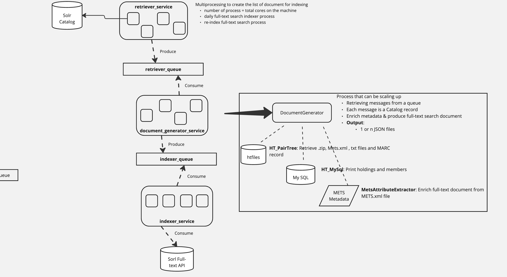
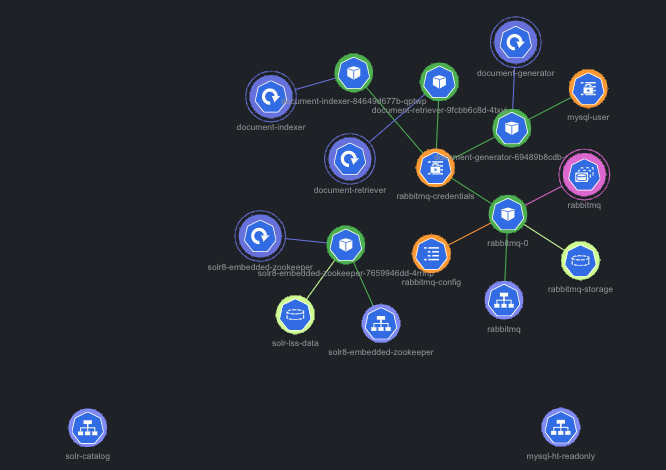

<br/>
  <p align="center">
    ht_indexer
    <br/>
    <br/>
    <a href="https://github.com/hathitrust/ht_indexer/issues">Report Bug</a>
    -
    <a href="https://github.com/hathitrust/ht_indexer/issues">Request Feature</a>
  </p>

## Table Of Contents

* [About the Project](#about-the-project)
* [Built With](#built-with)
* [Phases](#phases)
* [Project Set Up](#project-set-up)
    * [Prerequisites](#prerequisites)
    * [Installation](#installation)
* [Content Structure](#content-structure)
    * [Project Structure](#project-structure)
    * [Site Maps](#site-maps)
* [Design](#design)
* [Functionality](#functionality)
* [Usage](#usage)
* [Tests](#tests)
* [Hosting](#hosting)
* [Experiments](#experiments)
* [Resources](#resources)

## About the Project

Python application for indexing documents in Solr server (fulltext search index) using Docker.

The application contains a component based on [requests](https://docs.python-requests.org/en/latest/) for indexing
documents in a Solr server. The workflow instantiates two solr servers, through docker containers.

* Catalog (solr-sdr-catalog), for retrieving documents and
* Full-text (solr-lss-dev) search index for indexing them.

All the services are started using docker-compose.yml file, and it integrates a queue system to communicate the
systems involved in the flow to index documents in Full-text search index. The queue system is based on RabbitMQ.

## Built With

* [Python](https://www.python.org/)
* [Docker](https://www.docker.com/)
* [Solr](https://lucene.apache.org/solr/)
* [RabbitMQ](https://www.rabbitmq.com/)
* [MariaDB](https://mariadb.org/)
* [Pytest](https://docs.pytest.org/en/stable/)
* [Poetry](https://python-poetry.org/)

## Phases

* **Phase 1**: Create a FastAPI application to index documents in Solr server
* **Phase 2**: Create services to retrieve and index documents from Catalog index
* **Phase 3**: Integrate a queue system to manage the flow of documents to be indexed in Full-text search index
    * **Phase 3.1**: Split the architecture in three services: document_retriever_service, document_generator, and
      document_indexer_service and use a queue system to manage the flow of documents to be indexed in Full-text search.
* **Next steps**:
    * The process to retrieve the message from the dead-letter-exchange is not implemented yet.
    * Implement the query to reprocess all the documents in Catalog index.
        * If the list of documents is empty, so do a `--query *:*` and the query_field will be id to retrieve
          all the documents in the Catalog index.
    * Storage the different status of the documents that are being processed by ht_indexer pipeline.

## Project Set Up

* In your local environment, you can use the docker-compose.yml file to set up the services to retrieve and index
  documents in Solr server.

In your workdir:

1. Clone the repository:

   ```git clone git@github.com:hathitrust/ht_indexer.git```
2. Go to the folder ``cd ht_indexer``
3. Create the image

   `docker build -t document_generator .`

4. Run the services

    1. Retriever service

       `docker compose up document_retriever -d`

    2. Generator service

       `docker compose up document_generator -d`

    3. Indexer service

       `docker compose up document_indexer -d`

If you want to run the application in your local environment and outside the docker container, you should
follow the steps mentioned in the section [How to set up your python environment](#project-set-up-local-environment)

### Prerequisites

* Docker installed in your local environment
* If you want to run the application outside the docker container, you should set up:
    * the environment variables;
    * Python 3.11 and Poetry installed in your local environment
    * a pairtree-based repository to retrieve the documents to be indexed in Full-text search index.The documents should
      be stored in the folder, and these identifiers should be used to query the Catalog index. Find in section
      [How to create a folder simulating the pairtree-based repository](#creating-local-pairtree-based-repository) tips
      to
      create a pairtree-based repository in your local machine.

## Installation

1. Clone the repo
   ``` git clone git@github.com:hathitrust/ht_indexer.git```
2. Set up development environment with poetry
   In your workdir,
    * `poetry init` # It will set up your local environment and repository details
    * `poetry env use python` # To find the virtual environment directory, created by poetry
    * `source ~/ht-indexer-GQmvgxw4-py3.11/bin/activate` # Activate the virtual environment
    * `poetry add pytest` # Optional: Use this command if you want to add dependencies

## Content Structure

Three services are available in the application:

* **document_retriever_service**: Retrieve documents from Catalog index using.
* **document_generator**: Use the Catalog metadata and the file storage on pairtree-based repository to generate the
  the document to index in Solr.
* **document_indexer_service**: Index the documents in Full-text search index.

Two queues are available in the application to manage the flow of documents to be indexed in Full-text search index.

* **queue_retriever**: Queue to manage the flow of documents to be retrieved from Catalog index.
* **queue_indexer**: Queue to manage the flow of documents to be indexed in Full-text search index.

## Project Structure

The project is structured as follows:

```
ht_indexer/
├── catalog_metada/
│ ├── __init__.py
│ ├── catalog_metadata.py
│ └── catalog_metadata_test.py
├── document_generator/
│ ├── __init__.py
│ ├── document_generator_service.py
│ └── document_generator_service_local.py
| └──test_document_generator.py
├── document_indexer_service/
│ ├── __init__.py
│ └── document_indexer_service.py
| └──test_document_indexer_service.py
├── document_retriever_service/
│ ├── __init__.py
│ ├── catalog_metadata.py
│ ├── full_text_search_retriever_service.py
│ └── run_retriever_service_by_file.py
| └──test_document_retriever_service.py
├── ht_utils/
│ ├── __init__.py
│ └── sample_data/
│ ├── __init__.py
│ ├── sample_data_creator.sh
│ └── sample_data_generator.py
├── Dockerfile
├── docker-compose.yml
├── pyproject.toml
├── README.md
```

## Design

The application is structured as follows:



The system that publishes the messages to the queue is called the producer. The system that receives the messages from
the queue is called the consumer. The consumer service implements a mechanism to re-queue the messages that failed.
A message can fail for different reasons:

* The document is not found in the pairtree-based repository.
* The document is not found in the Catalog index.
* The queue system is down.
* The Solr server is down.

We use a **dead-letter-exchange** to handle messages that are not processed successfully. The dead-letter-exchange is
an exchange to which messages will be re-routed if they are rejected by the queue. In the current logic, all the service
using the queue system has a dead-letter-exschange associated with itve One of our future steps is to figure out what we
will do
with the messages in the dead-letter-exchange.

Find [here](https://www.rabbitmq.com/docs/dlx#overview) more details about dead letter exchanges.

Each of the defined queues (queue_retriever and queue_indexer) has a dead-letter-exchange associated with it
(retriever_queue_dead_letter_queue and indexer_queue_dead_letter_queue).

The image below shows the queues involved in the system.


When a consumer client receives a message from the queue, it will try to process the message.

* If the message is processed without issues, the message is acknowledged and removed from the queue.
* If the message is not processed, the message is re-queued in the dead-letter-exchange.
  As an example of this logic, you can see the code in the file
  `document_generator/document_generator_service.py` in the function `generate_document()`.

## Functionality

In all the use cases, a list of documents is received as input. The retriever_service retrieves the metadata of each
document from the Catalog index. The user must also provide a parameter indicating the catalog Solr field
used into the query. The Solr query is based on the field `id` or `ht_id`.

The field `id` is used if you want to process all the items on a record. The `ht_id` is used when a specific
item of a Catalog record will be processed.

The Solr query will look like this: `id:100673101` or `ht_id:umn.31951d01828300z`

### Use case 1: Generating & indexing one or N items retrieved from Catalog in Full-text search index:

The application receives a list of ids and a parameter that indicates if all the items in a record are processed
or only one item. Three different parts/clients are involved in this process, and the communication among them
is using a queue system.

### Use case 2: Generating & indexing long documents in Full-text search index:

There are some documents that exceed the maximum size of a message allowed by the queue system. In this case, only a
queue containing the metadata extracted from Catalog index is used. After that, the components for generating and
indexing the documents are used in sequence in a local environment.

### Use case 3: Populate retriever_queue using document ids listed in a file:

This use case is implemented by a python script that retrieves the id to populate the queue from a TXT file. This
use case is used to process in Kubernetes a batch of documents selected from production. See the section
``Run retriever service by file`` to find the command to run this use case.

## Usage

### All services (Retriever, Generator and Indexer) using the queue message system

* **Run retriever service**

```
docker compose exec document_retriever python document_retriever_service/full_text_search_retriever_service.py --list_documents chi.096189208,iau.31858049957305,hvd.32044106262314,chi.096415811,hvd.32044020307005,hvd.32044092647320,iau.31858042938971 --query_field item
```

* **Run retriever service by file**

```
docker compose exec document_retriever python document_retriever_service/run_retriever_service_by_file.py 
--query_field item --input_document_file document_retriever_service/list_htids_indexer_test.txt
```

* **Generator service**

```
docker compose up document_generator -d
```

This container will automatically start the script `python document_generator/document_generator_service.py` that will
be retrieving the documents from the retriever_queue and will be published a new message in indexer_queue

* **Indexer service**

```
docker compose up document_indexer -d
```

This container will automatically start the script `python document_indexer_service/document_indexer_service.py` that
will be retrieving the documents from the indexer_queue and will be indexing the documents in the Full-text search
index.

### Retriever writes into the queue and Generator/Indexer run in sequence in the same environment

* **Retriever service receives a list of document ids**

```
docker compose exec document_retriever python document_retriever_service/full_text_search_retriever_service.py --list_documents chi.096189208,iau.31858049957305,hvd.32044106262314,chi.096415811,hvd.32044020307005,hvd.32044092647320,iau.31858042938971 --query_field item
```

* **Generator service running locally**

The script ```document_generator_service_local.py``` is used to generate the document to index in full-text search
and to storage the file in a local folder (/tmp) in JSON format.

```docker compose exec document_generator python document_generator/document_generator_service_local.py --document_local_path /tmp --document_repository local```

* **Indexer service running locally**

```document_indexer_local_service.py``` The script should retrieve documents from the /tmp folder for indexing in Solr,
not from the queue.

```docker compose exec document_indexer python document_indexer_service/document_indexer_local_service.py --solr_indexing_api http://solr-lss-dev:8983/solr/#/core-x/ --document_local_path /tmp/indexing_data```

### Processing documents reading the list of ids from a file

The file is created using the Catalog index. The file contains the list of documents to be processed, and it is stored
in the root of this repository by default. E.g. ~/ht_indexer/filter_ids.txt.

```docker compose exec document_retriever python document_retriever_service/run_retriever_service_by_file.py```

## Tests

In the working directory,

* Create the image

```docker build -t document_generator .```

* Run document_retriever_service container and test it

```docker compose up document_retriever -d```

```docker compose exec document_retriever pytest document_retriever_service catalog_metadata ht_utils ```

* Run document_generator_service container and test it

```docker compose up document_generator -d```

```docker compose exec document_generator pytest document_generator ht_document ht_queue_service ht_utils```

* Run document_indexer_service container and test it

Solr server required authentication, so you should set up the environment variables SOLR_USER and SOLR_PASSWORD before
starting the container. All the users (solr, admin and fulltext) use the same solr password (solrRocks)

export SOLR_USER=admin
export SOLR_PASSWORD=solrRocks

```docker compose up document_indexer -d```

```docker compose exec document_indexer pytest document_indexer_service ht_indexer_api ht_queue_service```

## Hosting

Kubernetes is used to host the application. The application is deployed in MACC HathiTrust Kubernetes cluster in the
namespace `fulltext-workshop`. The application is deployed in the following pods:

* **document-generator**: Service to generate the document to index in Solr.
* **document-retriever**: Service to retrieve documents from Catalog index.
* **ht-indexer-indexer**: Service to index the documents in Full-text search index
* **rabbitmq**: Queue system to manage the flow of documents to be indexed in Full-text search index.
* **solr-embedded-zookeeper**: Full-text search Solr index.

In the image below, you can see the main kubernetes parts running in this workflow.


### How to run the full-text workflow in Kubernetes

* Connect to ht-macc cluster
    * I use [OpenLens](https://github.com/MuhammedKalkan/OpenLens) for this
* In OpenLens terminal:
    * Run the command to get a shell on the document_retriever service
        ``` 
      kubectl -n fulltext-workshop exec deployment/document-retriever -ti -- /bin/bash
      ```
    * Run the python script to retrieve documents from Catalog given a list of ht_ids
         ```
          python document_retriever_service/full_text_search_retriever_service.py --list_documents
              chi.096189208,iau.31858049957305,hvd.32044106262314,chi.096415811,hvd.32044020307005,hvd.32044092647320,iau.31858042938971
              --query_field item
        ```
    * Run the python script to retrieve documents from Catalog given a list of ht_ids stored in a file
      ```
      python document_retriever_service/run_retriever_service_by_file.py --query_field item
            --input_document_file filter_ids.txt
      ```
    * Run the command below to get a shell on the document_generator service
        ``` 
          kubectl -n fulltext-workshop exec deployment/document-generator -ti /bin/bash
        ```
    * Document generator

         ```
           python document_generator/document_generator_service.py --document_repository pairtree
        ```
    * Run the command below to get a shell on the document_indexer service

        ``` 
       kubectl -n fulltext-workshop exec deployment/document-indexer -ti -- /bin/bash
        ```
    * Document indexer
      ```
      python document_indexer_service/document_indexer_service.py
              --solr_indexing_api http://fulltext-workshop-solrcloud-headless:8983/solr/core-x/
      ```

    * In Kubernetes, you can also use the script `run_retriever_processor_kubernetes.sh` to run the services to retrieve
      documents and publish them into the queue.

        ```
        ./run_retriever_processor_kubernetes.sh
        ```
    * Example of how to retrieve only 1 document from Catalog index

      ```
      python document_retriever_service/full_text_search_retriever_service.py --query ht_id:"pur1.32754063106516"
      --document_repository pairtree
      ```

#### How to access RabbitMQ in Kubernetes

1. Using kubectl exec to get into the running rabbitmq container

   `kubectl -n fulltext-workshop exec -ti rabbitmq-0 -- /bin/bash`

2. See all the available queues and messages
   `rabbitmqctl list_queues`
3. Port forwarding for mgmt interface ==> To access to user interface http://localhost:15672
   `kubectl -n fulltext-workshop port-forward pod/rabbitmq-0 15672`

4. Get user/pass of Rabbitmq
   `kubectl -n fulltext-workshop get secret rabbitmq-secret -o jsonpath="{.data.rabbitmq-password}" | base64 --decode`
   `kubectl -n fulltext-workshop get secret rabbitmq-secret -o jsonpath="{.data.rabbitmq-username}" | base64 --decode`

## Experiments

1. Indexing one million of documents in the Solr server

The file document_retriever_service/1_million_filter_ids.txt contains a list of 1 million of ht_id to be indexed in the
Solr server. The file is generated querying the Catalog index and using the script get_list_ids_from_Solr_results.py
implemented in the repository `ht_full_text_search`.

The command used to retrieve the documents from Catalog index is:

```python document_retriever_service/run_retriever_service_by_file.py --query_field item --input_document_file 1_million_filter_ids.txt
```

This experiment will do in the Kubernetes cluster.

# Resources

### [How to set up your python environment](#project-set-up-local-environment)

On mac, you can use brew to install python and pyenv to manage the python versions.

* Install python
    * You can read this blog to install python in the right way in
      python: https://opensource.com/article/19/5/python-3-default-mac
        * I installed using brew and pyenv
* Install poetry:
    * **Good blog to understand and use poetry
      **: https://blog.networktocode.com/post/upgrade-your-python-project-with-poetry/
    * **Poetry docs**: https://python-poetry.org/docs/dependency-specification/
    * **How to manage Python projects with Poetry
      **: https://www.infoworld.com/article/3527850/how-to-manage-python-projects-with-poetry.html

* Useful poetry commands (Find more information about commands [here](https://python-poetry.org/docs/cli))
    * Inside the application folder: See the virtual environment used by the application `` poetry env use python ``
    * Activate the virtual environment: ``source ~/ht-indexer-GQmvgxw4-py3.11/bin/activate``, in Mac poetry creates
      their files in the home directory, e.g. /Users/user_name/Library/Caches/pypoetry/.
    * `` poetry export -f requirements.txt --output requirements.txt ``
    * Use `` poetry update `` if you change your .toml file and want to generate a new version the .lock file
    * Use ``poetry add ruff@latest`` to add the last version of the package ruff to your project
    * Use ``poetry add ruff@1.0.0`` to add a specific version of the package ruff to your project

### Additional use cases

These use cases have been created for experimental purposes. They are not used in the production environment.

#### Creating a TXT file listing ht_id from Catalog index

`python ht_indexer/document_retriever_service/catalog_retriever_service.py --query id:100673101
--output_file ~/tmp/ht_ids.txt`

* By default, the file will be created in the folder the root of the project

#### Retrieving files from pairtree-based repository

`python ~/ht_indexer/document_retriever_service/full_text_search_retriever_by_file.py
--list_ids_path /Users/lisepul/Documents/repositories/python/ht_indexer/filter_ids.txt`

#### Indexing the documents in full-text search index

`python3 ~/ht_indexer/document_indexer_service/document_indexer_service.py --solr_indexing_api
http://localhost:8983/solr/#/core-x/ --document_local_path ~/tmp/indexing_data`

#### Data Sampling: Create a sample of data:

Use this module if you want to download data from pairtree-based repository via scp and store it in your local
environment.

FY: This logic was adopted because it is complex to set up permission in the docker to access to pairtree repository via
scp

Find this module in: `ht_indexer/ht_utils/sample_data/`. All the logic is implemented in the
script `sample_data_creator.sh`.
The script will use the JSON file `full-output-catalog-index.json`, that contains an extract of the Catalog Solr index
to generate the list of items to index. The file `sample_data_ht_ids.txt` is generated to load the list of items.
The file `sample_data_path.txt` is also generated with the list of paths. We decided to get the pair-tree path using
python and use a shell script to download the documents via scp.

The script will generate the folder /sdr1/obj to download the .zip and .mets.xml file for the list of records.
The folder will be created in the parent directory of ht_indexer repository.

`sample_data_creator.sh` by default,

* 1% of the documents indexed in Catalog image will be added to the sample. You can change the default value
  passing a different value to the script `sample_data_creator.sh`, e.g., 0.50 to retrieve 50% of the documents in
  Catalog.
* only one item per Catalog record will be added to the sample. You can add all the items if you pass True as an
  argument
* sdr_dir=/sdr1/obj, you can also change this value passing a different argument.

I have had some issues running the python script with the docker (line 34 of `sample_data_creator.sh`). It seems python
is not able to receive the arguments defined as environment variables in the console.

To overcome it, I recommend using the python script directly to create the sample of data and before that you should
define the environment variables SAMPLE_PERCENTAGE and ALL_ITEMS.

``python ht_indexer/ht_utils/sample_data/sample_data_generator.py``

Once you have the list of documents, you want to include in the sample, comment line 34 of
the `sample_data_creator.sh` script and run it to download the files through scp protocol.

Steps to download a sample pairtree-based repository in your local environment:

In your workdir,

1. Set up the environment variable
   ```export HT_REPO_HOST=some.host.hathitrust.org```
2. Use a default set up for generating the folder with the documents to process:
   ```./ht_utils/sample_data/sample_data_creator.sh```
3. Passing arguments to generate the sample of data:
   ```./ht_utils/sample_data/sample_data_creator.sh 0.0011 /sdr1/obj```

Note: Follow the command below if you want to download files from pairtree repository data for testing

   ```
   $HT_SSH_HOST=some.host.hathitrust.org
   scp $HT_SSH_HOST:/sdr1/obj/umn/pairtree_root/31/95/1d/03/01/41/20/v/31951d03014120v/31951d03014120v{.zip,mets.xml} ../sdr1/obj
   ```

### DockerFile explanations

**What is the best python Docker image to use?**
This [post](https://pythonspeed.com/articles/base-image-python-docker-images/) help to make the decision

We are using the python image **python:3.11-slim-bookworm** as based on our docker. See
this [link](https://hub.docker.com/_/python) to have a
look to all the python official Docker images. The image is based on Debian Bookworm, released June 2023.

#### Relevant points to decide the image

* Given the speed improvements in 3.11, more important than the base image is making sure you’re on an up-to-date
  release of Python.
* The official Docker Python image is the absolute latest bugfix version of Python
* It has the absolute latest system packages
* Image system: Debian 12
* Image size: 51MB

The **python:alpine** image was tested, and it worked well, however, I decided to abandon it because it lacks the
package installer pip and the support for installing wheel packages, which are both necessary for installing
applications like Pandas and Numpy. Alpine image is the light one; then we should install several dependencies,
e.g. some compiler packages like GCC, then build the image takes time

### Reference used for python implementation

Python Linter:
Ruff: https://astral.sh/ruff
Enhancing Python Code Quality: A Comprehensive Guide to Linting with
Ruff: https://dev.to/ken_mwaura1/enhancing-python-code-quality-a-comprehensive-guide-to-linting-with-ruff-3d6g
Parser XML files
https://lxml.de/tutorial.html#parsing-from-strings-and-files
https://pymotw.com/3/xml.etree.ElementTree/parse.html

MySql
https://www.w3schools.com/python/python_mysql_join.asp

SSH + python script + environment variables to pass user/password
https://www.the-analytics.club/python-ssh-shell-commands/#google_vignette

Pypairtree
https://github.com/unt-libraries/pypairtree/tree/master

Mets fields documentation: https://mets.github.io/METS_Docs/mets_xsd_Attribute_Group_ORDERLABELS.html
Best practices for writing Dockerfiles: https://docs.docker.com/develop/develop-images/dockerfile_best-practices/
Docker reference: https://docs.docker.com/engine/reference/builder/#workdir
Interesting discussion about poetry and docker file:
https://stackoverflow.com/questions/53835198/integrating-python-poetry-with-docker/70161384#70161384
https://github.com/python-poetry/poetry/issues/1178
Poetry & docker good reference: https://github.com/max-pfeiffer/uvicorn-gunicorn-poetry/tree/main/build

Recommended python image: https://pythonspeed.com/articles/base-image-python-docker-images/

* Something I want to test in my Dockerfile: Use poetry for the dependency solver and then use pip for installing the
  final wheel. => Use poetry expert to generate requirements.txt file,
  use this blog as a
  reference: https://medium.com/vantageai/how-to-make-your-python-docker-images-secure-fast-small-b3a6870373a0
* See this video to reduce the size of the container: https://www.youtube.com/watch?v=kx-SeGbkNPU

### Command to use the API

Use this curl command to check if the API is ready to use

``curl --location 'http://localhost:8081/ping/'``

Using this prototype, you will be able to index an XML document stored in a data folder inside the server.

Use this curl command to add the XML file

``curl --location --request POST 'http://127.0.0.1:8081/solrIndexing/?path=data%2Fadd' \
--header 'Content-Type: text/plain' \
--data '@'``

Use this curl command to delete the XML file

``curl --location --request POST 'http://127.0.0.1:8081/solrIndexing/?path=data%2Fdelete'``

You can also run the application from your local machine without a docker file using the following command.
However, you will have to set up your python environment.

Use this curl command to query Sorl

``curl http://localhost:9033/solr/catalog/query -d 'json={"query":"ht_id:umn.31951000662660j"}'``

``poetry run python main.py --host 0.0.0.0 --port 8081 --solr_host localhost --solr_port 8983``
