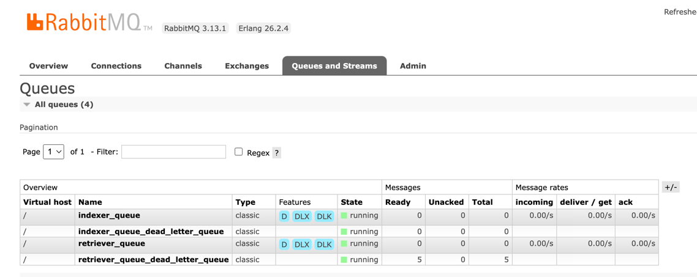

# ht_indexer

Application for indexing (add) documents in Solr server

This is a Python application, running within a Docker environment.
The application contains a component based on FastAPI for indexing JSON files in a Solr server

This application instantiates two solr servers, through docker containers. Catalog (solr-sdr-catalog), for retrieving
documents and Full-text (solr-lss-dev) search index for indexing them.

The application integrates a queue system to manage the flow of documents to be indexed in Full-text search index.

Three services are available in the application:

* document_retriever_service: Load an API to retrieve documents from Catalog index.
* document_generator: Use the Catalog metadata and the files storage on pairtree-based repository to generate the JSON.
* document_indexer_service: Load the API to index the documents in Full-text search index.

Two queues are available in the application to manage the flow of documents to be indexed in Full-text search index.

**queue_retriever**: Queue to manage the flow of documents to be retrieved from Catalog index.

**queue_indexer**: Queue to manage the flow of documents to be indexed in Full-text search index.

The system that publishes the messages to the queue is called the producer. The system that receives the messages from
the queue is called the consumer.

The consumer services implements a mechanism to re-queue the messages that failed. A message can fail for different
reasons,

* The document is not found in the pairtree-based repository.
* The document is not found in the Catalog index.
* The queue system is down.
* The Solr server is down.

We use a **dead-letter-exchange** to handle messages that are not processed successfully. The dead-letter-exchange is
an exchange to which messages will be re-routed if they are rejected by the queue.
Find [here](https://www.rabbitmq.com/docs/dlx#overview) more details about dead letter exchanges.

Each of the defined queues (queue_retriever and queue_indexer) has a dead-letter-exchange associated with it
(retriever_queue_dead_letter_queue and indexer_queue_dead_letter_queue).

The image below shows the queues involved in the system.



When a consumer client receive a message from the queue, it will try to process the message. If the message is well
process the message is acknowledged and removed from the queue. If the message is not processed, the message is
re-queued in the dead-letter-exchange. As an example of this logic, you can see the code in the file
`document_generator/document_generator_service.py` in the function `generate_document()`.

The process to retrieve the message from the dead-letter-exchange is not implemented yet.

## Use cases

For all the use cases, a list of documents is received. This workflow retrieve metadata from Catalog index, then a
parameter is received indicating the catalog solr field to query. The Solr query can contain the field id or ht_id.

The field id is used if you want to process all the items on
a record. The ht_id is used when a specific item of a Catalog record will be processed.

The Solr query will look like this: `id:100673101` or `ht_id:umn.31951d01828300z`

Not implemented yet: If the list of documents is empty, them do a query=*:* and the query_field will be id to retrieve
all the documents in Catalog index.

``` 
    --query *:* default query to retrieve all the documents in Catalog
```

**Use case 1: Generating and indexing one or N items retrieved from Catalog in Full-text search index:**
The application receives a list of ids and a parameter that indicates if all the items in a record will be processed
or only one item. Three different components/client are involved in this process and the communication among them
is using a queue system.

**Use case 1.1: The list of documents is retrieved from a file:**
This is use is used to process a batch of documents selected from production. It is used to test the
application in Kubernetes and considering production data.

**Use case 2: Generating and indexing long documents in Full-text search index:**
There are some documents that exceed the maximum size of message allowing by the queue system. In this case, only a
queue containing the metadata extracted from Catalog index is used. After that, the components for generating and
indexing the documents are used in sequence in a local environment.

**Use case 3: Generating documents listed in a file:**
This use case is implemented by a python script that retrieves the id to populate the queue from a TXT file. This
use case is used to process in Kubernetes a batch of documents selected from production. See the section
``Run retriever service by file`` to find the command to run this use case.

## How to test locally indexer service

In your workdir:

Step 1. Create /sdr1/obj directory
`mkdir ../sdr1/obj`

Step 2. Retrieve from pairtree repository data for testing
`scp $HT_SSH_HOST:/sdr1/obj/umn/pairtree_root/31/95/1d/03/01/41/20/v/31951d03014120v/31951d03014120v{.zip,mets.xml} ../sdr1/obj`

Step 3. Create the image
`docker build -t document_generator .`

Step 4. Run the container
`docker compose up document_retriever -d`

## Retriever, Generator and indexer complete queue message system

### Run retriever service

```docker compose exec document_retriever python document_retriever_service/full_text_search_retriever_service.py
--list_documents
chi.096189208,iau.31858049957305,hvd.32044106262314,chi.096415811,hvd.32044020307005,hvd.32044092647320,iau.31858042938971
--query_field item
```

### Run retriever service by file

```docker compose exec document_retriever python document_retriever_service/run_retriever_service_by_file.py 
--query_field item --input_document_file document_retriever_service/list_htids_indexer_test.txt
```

### Generator service

```docker compose up document_generator```

This container will automatically start the script `python document_generator/document_generator_service.py` that will
be retrieving the documents from the retriever_queue and will be published a new message in indexer_queue

### Indexer service

```docker compose up document_indexer```

This container will automatically start the script `python document_indexer_service/document_indexer_service.py` that
will be retrieving the documents from the indexer_queue and will be indexing the documents in the Full-text search
index.

## Retriever used a queue and Generator and indexer run in sequence in the same environment

### Retriever service = receive a list of documents

```docker compose exec document_retriever python document_retriever_service/full_text_search_retriever_service.py --list_documents chi.096189208,iau.31858049957305,hvd.32044106262314,chi.096415811,hvd.32044020307005,hvd.32044092647320,iau.31858042938971 --query_field item```

### Generator service Locally

```docker compose exec document_generator python document_generator/document_generator_service_local.py --document_local_path /tmp --document_repository local```

### Indexer service Locally

```docker compose exec document_indexer python document_indexer_service/document_indexer_local_service.py --solr_indexing_api http://solr-lss-dev:8983/solr/#/core-x/ --document_local_path /tmp/indexing_data```

## Use case for processing documents retrieved from a file

The file is created using the Catalog index. The file contains the list of documents to be processed and it is stored
in the root of this repository by default. e.g. ~/ht_indexer/filter_ids.txt

```docker compose exec document_retriever python run_retriever_service_by_file.py```

## Other usefull scripts

1- Create a TXT file listing ht_id from Catalog index
`python ht_indexer/document_retriever_service/catalog_retriever_service.py --query id:100673101
--output_file ~/tmp/ht_ids.txt`

* By default, the file will be created in the folder the root of the project

2- Retrieve files from pairtree-based repository
`python ~/ht_indexer/document_retriever_service/full_text_search_retriever_by_file.py
--list_ids_path /Users/lisepul/Documents/repositories/python/ht_indexer/filter_ids.txt`

4- Index the documents in full-text search index
`python3 ~/ht_indexer/document_indexer_service/document_indexer_service.py --solr_indexing_api
http://localhost:8983/solr/#/core-x/ --document_local_path ~/tmp/indexing_data`

## Setting up ht_indexer

1. Clone the repository in your working environment

```git clone git@github.com:hathitrust/ht_indexer.git```

2. Then, go to the folder ``cd ht_indexer``

##### Testing locally:

1. ###### [Optional] Data Sampling: Create a sample of data:
    2. In your workdir,
        3. Set up the environment variable
           ```export HT_REPO_HOST=some.host.hathitrust.org```
        4. Use a default set up for generating the folder with the documents to process:
           ```./ht_utils/sample_data/sample_data_creator.sh```
        5. Passing arguments to generate the sample of data:
           ```./ht_utils/sample_data/sample_data_creator.sh 0.0011 /sdr1/obj```

## Data Sampling:

FY: [Temporal solution until implement the queue system]

Use this module if you want to download data from pairtree-based repository via scp and store it in your local
environment.

FY: This logic was adopted because is complex to set up permission in the docker to access to pairtree repository via
scp

Find this module in: `ht_indexer/ht_utils/sample_data/`. All the logic is implemented in the
script `sample_data_creator.sh`.
The script will use the JSON file `full-output-catalog-index.json`, that contains an extract of the Catalog Solr index
to generate the list of items to index. The file `sample_data_ht_ids.txt` is generated to load the list of items.
The file `sample_data_path.txt` is also generated with the list of paths. We decided to obtain the pair-tree path using
python and use shell script to download the documents via scp.

The script will generate the folder /sdr1/obj to download the .zip and .mets.xml file for the list of records.
The folder will be created in the parent directory of ht_indexer repository.

`sample_data_creator.sh` by default,

* 1% of the documents indexed in Catalog image will be added to the sample. You can change the default value
  passing a different value to the script `sample_data_creator.sh`, e.g. 0.50 to retrieve 50% of the documents in
  Catalog.
* only one item per Catalog record will be added to the sample. You can add all the items if you pass True as an
  argument
* sdr_dir=/sdr1/obj, you can also change this value passing a different argument.

I have had some issues running the python script with the docker (line 34 of `sample_data_creator.sh`). It seems python
is not able to receive the arguments defined as environment variables in the console.

To overcome it, I recommend to use the python script directly to create the sample of data and before that you should
define the environment variables SAMPLE_PERCENTAGE and ALL_ITEMS.

``python ht_indexer/ht_utils/sample_data/sample_data_generator.py``

Once you have the list of documents you want to include in the sample, comment the line 34 of
the `sample_data_creator.sh`
script and run it to download the files through scp protocol.

## Run the services for retrieving and indexing data

In your workdir, run te scripts `run_retriever_processor.sh`  to generate the XML file to index in full-text search
index.

This services access to MariaDB database and Solr to obtain the metadata of each item.
It also extracts metadata from .zip and .mets.xml files
In the docker-compose.yml file, you will find all the environment variables used by this component.
You will also see, the module use two volume for I/O operations.
It should access to `/sdr1/obj` folder to retrieve the .zip and mets.xml and it all the xml files generated by this
component are stored in `/tmp/indexing_data` folder.

To use in Kubernetes:
**Service retriever** is able to retrieve the documents to process from Catalog (catalog) index.
In this case, it must access to a paitree-based repository to retrieve the files of the selected items.

To use in your local environment:
**Service retriever** is able to retrieve the items to process from a local file with the list of items to process.
In this case, all the files have to be in a folder in your local environment (`/sdr1/obj`).

As a parameter to the script `full_text_search_retriever_service.py`, you can use `--document_local_path` to
define the folder to store the generated XML files. This parameter is manly used for testing purposes in your local
environment.

2. Indexing data: ```bash run_retriever_processor.sh```
    3. ```docker compose exec document_indexer python document_indexer_service/document_indexer_service.py --solr_indexing_api http://solr-lss-dev:8983/solr/#/core-x/```

If everything works well, in your browser you will access to the API documentation http://localhost:8081/docs/. You will
also find the indexed documents in http://localhost:8983/solr/#/core-x/query?q=*:*&q.op=OR&indent=true

## Python command to use the services for indexing documents in Full-text search index (local environment)

``python document_retriever_service/full_text_search_retriever_service.py
--solr_url http://localhost:9033/solr/#/catalog/ --mysql_host mudslide.umdl.umich.edu --mysql_user user_name
--mysql_pass pass --mysql_database ht --query id:hvd.hnr4tg --all_items ``

* If --query parameter is not passed, all the record in Catalog index will be indexed in Full-text search
* By default, only the first item of each record in Catalog are indexed in Full-text search, if --all_items parameter is
  passed, then all the items of the record are added.
    * You can use the command below to index all the item of a specific record
        * `` --solr_url http://localhost:9033/solr/#/catalog/ --mysql_host mudslide.umdl.umich.edu --mysql_user user_name --mysql_pass
          pass --mysql_database ht --query id:012407877 ``
          Use this command to run solr container
        * ```docker-compose up -d solr-sdr-catalog solr-lss-dev test```

* To run it locally, you should pass the path to the folder with the XML files to index
    * ``python document_retriever_service/full_text_search_retriever_service.py --document_local_path /User/..../tmp``

Use the command below to start the service to index documents

``
python document_indexer_service/document_indexer_service.py --solr_indexing_api http://localhost:8983/solr/#/core-x/
``

* To run it locally, you should pass the path to the folder with the XML files to index.

``
python document_indexer_service/document_indexer_service.py --solr_indexing_api http://localhost:8983/solr/#/core-x/
--document_local_path /User/..../tmp
``

To run testing locally you would execute `ht_indexer_api_test.py`

Inside the project folder run `python -m pytest` or `pytest`

## [Optional] Data preparation

Create a container with a volume with the documents to process
`docker run -d --rm --name data_creator -v sample_data:/sdr1 alpine tail -f /dev/null`

Use the container to populate the volume with local data
`docker cp ../sample_data/sdr1 data_creator:/sdr1`

Stop the container and the volume will persist
`docker stop data_creator`

## [Optional] How to set up your python environment

On mac,

* Install python
    * You can read this blog to install python in a right way in
      python: https://opensource.com/article/19/5/python-3-default-mac
        * I installed using brew and pyenv
* Install poetry:
    * **Good blog to understand and use poetry
      **: https://blog.networktocode.com/post/upgrade-your-python-project-with-poetry/
    * **Poetry docs**: https://python-poetry.org/docs/dependency-specification/
    * **How to manage Python projects with Poetry
      **: https://www.infoworld.com/article/3527850/how-to-manage-python-projects-with-poetry.html

* Usefull poetry commands (Find more information about commands [here](https://python-poetry.org/docs/cli))
    * Inside the application folder: See the virtual environment used by the application `` poetry env use python ``
    * Activate the virtual environment: ``source ~/ht-indexer-GQmvgxw4-py3.11/bin/activate``, in Mac poetry creates
      their files in the home directory, e.g. /Users/user_name/Library/Caches/pypoetry/..
    * `` poetry export -f requirements.txt --output requirements.txt ``
    * Use `` poetry update `` if you change your .toml file and want to generate a new version the .lock file
    * Use ``poetry add ruff@latest`` to add the last version of the package ruff to your project
    * Use ``poetry add ruff@1.0.0`` to add a specific version of the package ruff to your project

## DockerFile explanations

**What is the best python Docker image to use?**
This [post](https://pythonspeed.com/articles/base-image-python-docker-images/)
help to make the decision

We are using the python image **python:3.11-slim-bookworm** as based of our docker.
See this [link](https://hub.docker.com/_/python) to have a look to all the python official Docker images.

The image is based on Debian Bookworm, released June 2023

### Relevant points to decide the image

* Given the speed improvements in 3.11, more important than the base image is making sure you’re on an up-to-date
  release
  of Python.

* The official Docker Python image the absolute latest bugfix version of Python
* It has the absolute latest system packages
* Image system: Debian 12
* Image size: 51MB

The **python:alpine** image was tested and it worked well however I decided to abandon it because it lacks the package
installer
pip and the support for installing wheel packages, which are both needed for installing applications like Pandas and
Numpy. Alpine image is the light one, then we should install several dependencies, e.g. some compiler packages like GCC,
then build the image takes time

## Document generator

Before using this script you should set up the following environment variables

export HOST=something.hathitrust.org
export USER=your_user_name
export PUBLIC_KEY=public_key_name

Reference used for python implementation

Python Linter:
Ruff: https://astral.sh/ruff
Enhancing Python Code Quality: A Comprehensive Guide to Linting with
Ruff: https://dev.to/ken_mwaura1/enhancing-python-code-quality-a-comprehensive-guide-to-linting-with-ruff-3d6g
Parser XML files
https://lxml.de/tutorial.html#parsing-from-strings-and-files
https://pymotw.com/3/xml.etree.ElementTree/parse.html

MySql
https://www.w3schools.com/python/python_mysql_join.asp

SSH + python script + environment variables to pass user/password
https://www.the-analytics.club/python-ssh-shell-commands/#google_vignette

Pypairtree
https://github.com/unt-libraries/pypairtree/tree/master

Mets fields documentation: https://mets.github.io/METS_Docs/mets_xsd_Attribute_Group_ORDERLABELS.html
Best practices for writing Dockerfiles: https://docs.docker.com/develop/develop-images/dockerfile_best-practices/
Docker reference: https://docs.docker.com/engine/reference/builder/#workdir
Interesting discussion about poetry and docker file:
https://stackoverflow.com/questions/53835198/integrating-python-poetry-with-docker/70161384#70161384
https://github.com/python-poetry/poetry/issues/1178
Poetry & docker good reference: https://github.com/max-pfeiffer/uvicorn-gunicorn-poetry/tree/main/build

Recommended python image: https://pythonspeed.com/articles/base-image-python-docker-images/

* Something I want to test in my Dockerfile: Use poetry for the dependency solver and then use pip for installing the
  final wheel. => Use poetry expert to generate requirements.txt file,
  use this blog as a
  reference: https://medium.com/vantageai/how-to-make-your-python-docker-images-secure-fast-small-b3a6870373a0
* See this video to reduce the size of the container: https://www.youtube.com/watch?v=kx-SeGbkNPU

## Command to use the API

Use this curl command to check if the API is ready to use

``curl --location 'http://localhost:8081/ping/'``

Using this prototype you will be able to index an XML document stored in a data folder inside the server.

Use this curl command to add the XML file

``curl --location --request POST 'http://127.0.0.1:8081/solrIndexing/?path=data%2Fadd' \
--header 'Content-Type: text/plain' \
--data '@'``

Use this curl command to delete the XML file

``curl --location --request POST 'http://127.0.0.1:8081/solrIndexing/?path=data%2Fdelete'``

You can also run the application from your local machine without a docker file using the following command.
However, you will have to set up you python environment.

Use this curl command to query Sorl

``curl http://localhost:9033/solr/catalog/query -d 'json={"query":"ht_id:umn.31951000662660j"}'``

``poetry run python main.py --host 0.0.0.0 --port 8081 --solr_host localhost --solr_port 8983``

# Another temporary change to remove