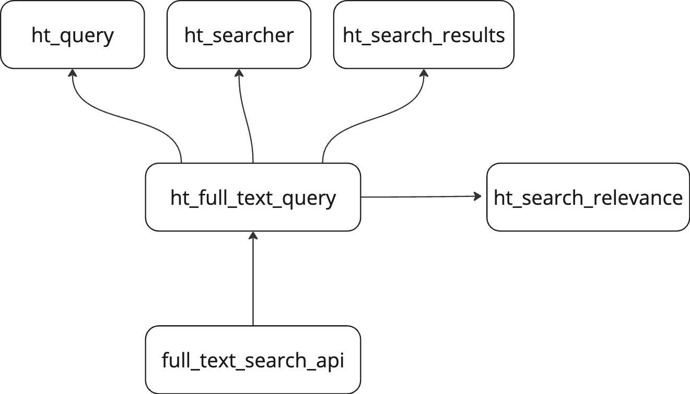

<br/>
  <p align="center">
    HT_Search library
    <br/>
    <br/>
    <a href="https://github.com/hathitrust/index_search_monorepo/tree/main/libs/ht_search">README.md</a>
  </p>

## Table Of Contents

* [About the Project](#about-the-project)
* [Built With](#built-with)
* [Phases](#phases)
* [Project Set Up](#project-set-up)
  * [Prerequisites](#prerequisites)
  * [Installation](#installation)
  * [Creating A Pull Request](#creating-a-pull-request)
* [Content Structure](#content-structure)
  * [Project Structure](#project-structure)
  * [Site Maps](#site-maps)
* [Design](#design)
* [Functionality](#functionality)
* [Usage](#usage)
* [Tests](#tests)
* [Hosting](#hosting)
* [Resources](#resources)

## About The Project

Library for searching documents in Solr server. This application reproduces the queries we use in the 
HathiTrust full-text search service.

## Built With
It is based on the [requests](https://docs.python-requests.org/en/latest/) library to access the Solr server.

## Phases
- Phase 1
  - Build a Python library to search documents in the Solr server.
  - Reproduce the queries we use in the HathiTrust full-text search service, the production code is implemented in perl language.

- Phase 2 
  - Implement solr cursor-based paging to download large result sets (over 20,000 items) using the Solr export handler.

- Phase 3 — Future Additions
    - Generalize the library to be used in other indexes, not just the full-text search index.
    - Implement the logic to get Solr facets
    - Implement the logic to generate the filters to use in the Solr queries

## Project Set Up
* This is a Python project that uses Poetry to manage dependencies and virtual environments. It should be used as a 
dependency in other Python projects if you want to access the Solr server and search documents in it.

To include this library in other Python projects, you can add it to your `pyproject.toml` file as follows:

```toml 
[tool.poetry.dependencies]
ht-utils = {path = "../../libs/common_lib"}
```

### Installation

1. Clone the repo
   ``` git clone https://github.com/hathitrust/index_search_monorepo.git```

2. Set up a development environment with poetry

    - Install [Poetry](https://python-poetry.org/docs/#installation) if you haven't already.
    - Navigate to the project directory:
      ```bash
      cd index_search_monorepo/libs/ht_search
      ```
    - Install the dependencies:
      ```bash
      poetry install
      ```
    - If you want to update the dependencies, you can use:
      ```bash
      poetry update
      ```

## Content Structure

Miro board: [Full text search](https://miro.com/app/board/uXjVM1-Swlw=/)

### Site Maps

This library contains the following files:

### Project Structure

The project is structured as follows:

```aiignore

libs/ht_search
├── pyproject.toml
├── README.md
├── poetry.lock
├── src
│   └── ht_search
│       ├── __init__.py
│       ├── ht_searcher.py
│       ├── ht_query.py
│       ├── ht_search_results.py
│       ├── config_search.py
│       ├── export_all_results.py
│       ├── documentation
│       │   ├── application_architecture.png
├── tests
│       ├── conftest.py
│       │   [other tests]
```

## Design

The infrastructure of the library is based on the following scripts. All of them are used to create the Solr query 
and search the documents in the Solr server. In the image below, you can see the classes and their relationships.



The scripts are:
* `ht_full_text_searcher.py`: Contains the class responsible for creating the Solr query in the full-text search index
* `ht_searcher.py`: This class encapsulates the search interface to Solr
* `ht_query.py`: This class is responsible for creating the Solr query
* `ht_search_results.py`: This class is responsible for presenting the Solr results
* `Config_files`: This folder contains the YAML file setting the configuration of the Solr query

**Use case 1**: Run the application with a query that searches by phrase in the full text of the documents
There are three different ways to search by string in the documents:

**Documentation about Solr queries**: https://hathitrust.atlassian.net/wiki/spaces/HAT/pages/2741141540/Current+Solr+queries+Explanation

* Search the string in all the fields of the documents
* Search the string in the OCR field of the documents

The Solr query is built based on the input parameters. The query can be built using the `AND`, `OR` and None operator.
   * the query with the operator None will search the exact phrase in the documents. None is the default value, then you do not have to pass it in the command line
     * e.g. "justice blame"
   * the query with the operator `AND` will search the documents that contain both words in the phrase, 
     * e.g. justice AND blame
   * the query with the operator `OR` will search the documents that contain at least one of the words in the phrase, 
     * e.g. justice OR blame

## Tests
- This application is tested using the pytest library.
- To run the tests, you can use the command `pytest` in the terminal.
- ```docker compose exec ht_search_tests python -m pytest```

## Resources

### Transforms the Solr query from string to JSON

``` 
query = curl "http://localhost:8983/solr/tmdb/query?" -d '{	"query": {"bool": {"must": [{ "edismax":{"qf": "title genres","query":"breakfast"}},{ "edismax":{"qf": "title genres","query":"comedy"}}]}}}'
# JSON Query DSL in verbose way, it is better to understand the query
        json_query = {
            "query": {
                "edismax": {  # query parser
                    "qf": "ocr",  # qf = query fields
                    "query": "26th Regiment of Foot",  # query = query string
                    "mm": "100%25",  # mm = minimum match
                    "tie": "0.9",  # tie = tie breaker
                },
                "fl": ["author", "id", "title"],  # fl = fields to return
            },
            "start": "0",
            "rows": "10",
            "fl": "id",
            "indent": "on",
        }
```

## References

Python HTTP libraries: [requests vs urllib3](https://medium.com/@technige/what-does-requests-offer-over-urllib3-in-2022-e6a38d9273d9)
Requests: [Sessions and authentication](https://www.geeksforgeeks.org/python-requests-tutorial/)
